# Results vs. the paper

Comparison of this workflow against
*"Scalable Higher Resolution Polar Sea Ice Classification and Freeboard Calculation from ICESat-2
ATL03 Data"* (Iqrah, Koo, Wang, Xie & Prasad, IPDPSW 2025; arXiv:2502.02700v1).

Two runs on pegasus-submit, 2026-09-17: **run0005** (single GPU) supplies the classification and
freeboard results; **run0009** (`--horovod --n-gpus 2`) supplies the distributed-training results in
section 4.

**Inputs**: the author's six manually corrected tracks (`IS2_Corrected_data.zip`) covering the two
tracks used in the paper's figures, `20191104195311_05940510` and `20191126182014_09290510`, beams
gt1r and gt2r. 139,335 labelled 2 m segments become 134,249 five-timestep windows.

| | |
|---|---|
| Comparable now | Classification accuracy, per-class accuracy, freeboard magnitude and distribution shape, resolution, Horovod training scaling |
| **Not** comparable without more data | Anything requiring ATL07/ATL10 (sea-surface offset, freeboard agreement, density ratio) — see [What is still missing](#what-is-still-missing) |
| Not applicable | The PySpark speedup tables (II and V) — those stages are a Pegasus fan-out here, a different mechanism |

---

## 1. Classification accuracy

Held-out 20 % test split, 26,850 windows. The paper does not state whether its Table III figures are
on a held-out split; the author's notebook evaluates on its own held-out 20 % split and reports
95.47 % there (Notebook 3, cell 38), so the paper's 96.56 % most likely is too.

| Metric | Paper LSTM | Paper MLP | **This run** | Delta vs paper LSTM |
|---|---|---|---|---|
| Accuracy | 96.56 | 91.80 | **95.93** | −0.63 |
| Precision | 97.00 | 91.80 | **96.60** | −0.40 |
| Recall | 96.09 | 91.80 | **95.32** | −0.77 |
| F1 | 96.54 | 91.79 | **95.94** | −0.60 |

Per-class accuracy (paper Fig. 4 vs this run's Fig. 4, both row-normalised):

| Class | Paper | **This run** | Delta |
|---|---|---|---|
| Thick ice | 98.39 | **97.28** | −1.11 |
| Thin ice | 73.80 | **80.19** | **+6.39** |
| Open water | 60.25 | **76.49** | **+16.24** |

**Reading.** Overall accuracy lands 0.63 points below the paper, on four tracks rather than the
paper's larger set. The gap is entirely in thick ice, which is 92.5 % of the data and therefore
dominates the headline number. The two minority classes — the ones the paper singles out as
difficult — are substantially better here, open water by 16 points.

That trade is what the focal loss is for, and it is the more useful behaviour for this pipeline:
freeboard depends on finding open-water leads, so open-water recall feeds directly into the sea
surface estimate. A model that is 1 point better on thick ice and 16 points worse on water would
produce worse freeboard.

Confusion matrix, this run (rows are truth, counts):

| | Pred. thick | Pred. thin | Pred. water |
|---|---|---|---|
| **Thick ice** | 24,181 | 567 | 108 |
| **Thin ice** | 187 | 1,101 | 85 |
| **Open water** | 23 | 123 | 475 |

Residual confusion is almost entirely thick↔thin at ice-type transitions, which is where the author
also had to hand-correct the Sentinel-2 labels.

**Caveats on this comparison.**

- Training is stochastic and no seed is fixed for weight initialisation or dropout: run0002 and
  run0005 differ by 0.03 points overall but by 4 points on thin ice and 8 on open water. Single-run
  per-class figures should be read as approximate.
- The paper's dataset is not the same as ours, but not obviously larger. The notebook's prepared
  set has 122,936 windows, consistent with four of the six shared files; ours has 134,249 from all
  six. The paper trains on 80 % (about 98,000 to 103,000 windows) where this run trains on 60 %
  (80,549), so the paper's model saw roughly a quarter more training windows drawn from a slightly
  smaller pool.
- Features are not certain to match. The paper says 6 per timestep; the notebook builds 8 and the
  workflow uses those 8, but the notebook's final model cell declares an input shape of `(5, 6)`.
  Which six the paper used cannot be recovered from the text.
- Both the paper's model and ours use `rel_height_min_elev`, a feature computed from the
  **ground-truth** open-water labels of the surrounding 10 km window (Notebook 2). The comparison
  is like for like, but neither accuracy is a fair estimate for unlabelled tracks, where the
  feature does not exist. See the Reference section of the README.
- The notebook's `(x - mean) / (1 - std)` normalisation, reproduced here, scales `bcnt_mean` and
  `brate_mean` to effectively zero, so the model in practice sees six informative features.
- Precision, recall and F1 above are the notebook's custom Keras metrics (batch-averaged, on
  rounded softmax outputs), which is what Table III reports. scikit-learn's weighted F1 on the same
  predictions is 96.17 and its macro F1 is 80.50.

### What MLP and LSTM are, and why the LSTM wins

**MLP** stands for **Multi-Layer Perceptron**: an ordinary feed-forward neural network. Layers of
neurons, every neuron wired to every neuron in the next layer, information flowing straight through
with no memory of what came before. The paper uses it as the baseline the LSTM has to beat
(Section III.B.2: the same input, one dense layer of 32 units with ReLU activation, then a 3-way
softmax over the three classes).

**LSTM** stands for **Long Short-Term Memory**: a recurrent network that reads its input as an
ordered sequence, carrying state from one step to the next.

The difference that matters here is how each one sees a sample. Every sample is 5 consecutive 2 m
segments along the track, each described by 8 features:

```
        segment:   n-2      n-1       n       n+1      n+2
                    |        |        |        |        |
   MLP sees:  [ ................ 40 numbers ................ ]   order carries no meaning
   LSTM sees: [ 8 ] -> [ 8 ] -> [ 8 ] -> [ 8 ] -> [ 8 ]          order is the input
                                  ^
                          the segment being classified
```

An MLP receives those 40 numbers as one flat list and has no idea that some describe the segment
*before* the one being classified and some the segment *after*. Shuffle the inputs consistently and
it would train just as well. The LSTM steps through them in along-track order, so it can use the
fact that a lead is a dip *between* two floes rather than merely a low reading in isolation.

That ordering is exactly the signal in this problem, which is why the paper reports 96.56 % for the
LSTM against 91.80 % for the MLP, and uses the LSTM for everything afterwards.

**The MLP row is not reproduced here.** This workflow implements only the LSTM, so the MLP column
above is quoted from the paper rather than measured.

---

## 2. Freeboard

| Track | Segments | Along-track span | Mean | Median | p10 | p90 |
|---|---|---|---|---|---|---|
| 20191104195311_05940510_gt1r | 49,451 | 110.3 km + 23.3 km, 92 km apart | 0.521 m | 0.438 m | 0.091 m | 1.101 m |
| 20191104195311_05940510_gt2r | 40,429 | 109.7 km | 0.503 m | 0.379 m | 0.062 m | 1.082 m |
| 20191126182014_09290510_gt1r | 24,365 | 55.8 km | 0.927 m | 0.995 m | 0.102 m | 1.504 m |
| 20191126182014_09290510_gt2r | 20,004 | 51.5 km | 0.897 m | 0.961 m | 0.155 m | 1.471 m |

Values are `freeboard_new_h_ref_smooth` over segments classified as ice, i.e. NASA's weighted-lead
sea surface followed by the Notebook 6 smoothing, recomputed from the run0005 predictions with the
current `compute_freeboard.py` defaults. The freeboard stage is deterministic given the
predictions, so only the smoothing change below moves any number.

**Two things to know before reading the table against the paper.**

- *The Nov 4 gt1r track is two Sentinel-2 tiles 92 km apart* (T02CNA and T02CNC), merged because
  they share a granule and beam. Notebook 6's smoothing window is 10,000 rows either side, which is
  longer than the smaller tile, so in run0005 that tile's sea surface was partly set by values from
  the other tile. `compute_freeboard.py` now smooths pieces separated by more than 10 km
  independently (`--smooth-max-gap`); that moves this track's mean from 0.529 m to 0.521 m and its
  median from 0.445 m to 0.438 m, and leaves the other three tracks unchanged.
- *Windows without predicted open water borrow thin ice as leads.* The notebook (and, by default,
  this workflow) applies NASA's lead equation to thin-ice segments when a 10 km window has no
  predicted water. The paper instead says such windows are interpolated from their neighbours. On
  these four tracks 15 of 70 windows take the fallback. `--lead-fallback none` gives the paper's
  behaviour; it lowers the Nov 4 gt1r mean to 0.470 m and leaves the other tracks within 0.001 m,
  because their few fallback windows sit where interpolation gives a similar value anyway.
- *The Notebook 6 water-threshold mask is not applied.* For the figures that compare against ATL07,
  the notebook masks the raw sea surface above 0.2 m plus the mean ATL03-minus-ATL07 offset before
  smoothing. That offset needs ATL07 data, so the mask is off here (`--water-threshold`).

**Agreement with the paper's description.** The paper does not tabulate freeboard values, so only
its qualitative claims can be checked:

- *"freeboard distributions show similar peak values"* — our distributions (Fig. 14a) are bimodal,
  with a thin-ice/lead peak near 0.15–0.25 m and an ice peak near 1.0 m, matching the shape of the
  paper's Fig. 10c and 11c.
- *Nov 26 higher than Nov 4* — reproduced: median 0.96–1.00 m on 26 November against 0.38–0.45 m on
  4 November, consistent with the paper's figures for the same two tracks.
- *Freeboard above zero* — 97.4 % of ice segments are positive overall, between 95.0 % (Nov 4 gt2r)
  and 99.1 % (Nov 26 gt2r) per track; the negative tail comes from the smoothed sea surface sitting
  slightly above individual thin-ice returns.

**Sea surface methods** (paper §III.D.1 tests four; mean and standard deviation over all four tracks):

| Method | Mean (m) | Std (m) |
|---|---|---|
| Minimum elevation | 0.337 | 0.122 |
| Average elevation | 0.469 | 0.080 |
| Nearest minimum elevation | 0.402 | 0.112 |
| NASA equation, raw | 0.532 | 0.305 |
| **NASA equation, smoothed** | **0.364** | **0.103** |
| NASA equation, raw, `--lead-fallback none` | 0.458 | 0.095 |

The paper selects the NASA formula because it gives "a smoother local sea surface". Our raw NASA
surface is in fact the *roughest* of the four (std 0.305 m); it only becomes the smoothest after the
Notebook 6 post-processing, which the paper's text does not mention but its figures clearly use.
Most of that roughness is the thin-ice fallback: windows with no predicted water get a sea surface
from thin-ice heights, which sit 0.2 to 0.5 m above water, and the `nanmin` smoothing is what
removes those excursions. With the paper's interpolation rule instead (last row) the raw surface's
spread drops from 0.305 m to 0.095 m, second only to the average-elevation method, before any
smoothing. So the smoothing is not optional in the notebook's pipeline, and the reason is the
fallback.

---

## 3. Resolution

| | Segment length | Segments per km |
|---|---|---|
| ATL07 / ATL10 (paper §I) | 10–200 m strong beam | 5–100 |
| **This run** (2 m sampling) | 2 m | **346–486 measured** |

Measured density is below the theoretical 500/km because gaps remain where photons were filtered
out (99.1 to 99.6 % of consecutive segments are exactly 2 m apart, the rest are short gaps). The
Nov 4 gt1r track is counted per tile (346 and 486 per km over 110 km and 23 km), because its two
tiles are 92 km apart and a single "span" for it would be meaningless. The paper's central claim — that 2 m resampling of ATL03 yields
a denser product than ATL07 and ATL10 — holds by construction and is confirmed by these counts, but
the *ratio* against ATL07 on the same tracks cannot be measured without the ATL07 granules.

---

## 4. Scaling and distributed training

The paper parallelises three things. Two of them are not comparable, one now is.

| Paper | Mechanism | Comparable here? |
|---|---|---|
| Auto-labeling, 16.25x (Table II) | PySpark on Google Cloud Dataproc | No - that stage runs before this workflow |
| Freeboard, 15.68x (Table V) | PySpark on Google Cloud Dataproc | No - here it is a Pegasus fan-out, a different mechanism |
| LSTM training, 7.25x on 8 GPUs (Table IV) | Horovod, data-parallel | **Yes** |

### Horovod training, measured

`--horovod --n-gpus 2` ran end to end (run0009). Both ranks initialised, took disjoint shards of the
training set, and finished with byte-identical test metrics - which is the check that gradients were
actually averaged, since two independently trained models would not agree:

```
Horovod rank 0/2: training on 40275 of 80549 windows (val 13425)
Horovod rank 1/2: training on 40274 of 80549 windows (val 13425)
Training time: 709.3 seconds        (both ranks)
Test - Acc: 0.9559, F1: 0.9570      (both ranks, identical)
```

Against the paper's Table IV:

| GPUs | Paper time/epoch | Paper speedup | **This workflow time/epoch** | **This workflow speedup** |
|---|---|---|---|---|
| 1 | 5.50 s | 1.00x | **14.80 s** | **1.00x** |
| 2 | 2.78 s | 1.96x | **14.19 s** | **1.04x** |
| 4 | 1.45 s | 3.81x | not reachable | - |
| 6 | 0.97 s | 5.68x | not reachable | - |
| 8 | 0.79 s | 7.25x | not reachable | - |

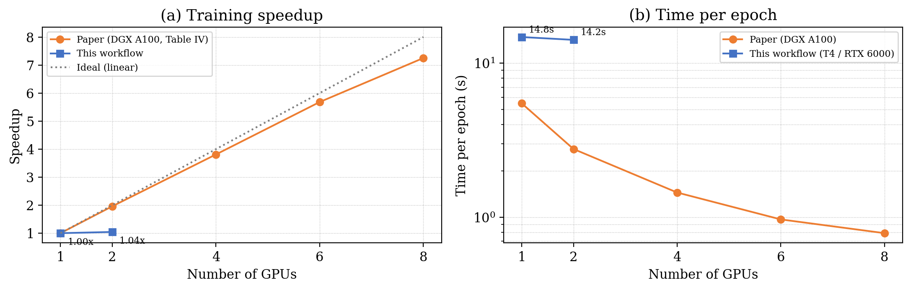

Rows beyond 2 GPUs are unreachable on this cluster, not untested: HTCondor's vanilla universe gives
a job one machine, and the GPU workers here have 2 GPUs each. The paper's 8 GPUs were all inside a
single DGX A100.

**Accuracy is preserved, the speedup is not.** 95.59 % on two ranks against 95.93 % on one is within
the run-to-run spread of this stochastic training, so the paper's central claim - that distributing
training costs no accuracy - reproduces. The 1.04x against their 1.96x does not.

The cause is visible in panel (b) rather than in the Horovod wiring. Each rank halves its step count
(1,259 per epoch instead of 2,517), so a GPU-bound step would nearly halve the epoch. Instead the
epoch barely moves. That points to a step dominated by Python-side batch preparation from in-memory
NumPy arrays rather than GPU compute, so the model is starved and an added all-reduce per step
cancels what sharding saves. The model is tiny - 12,051 parameters - which makes this the expected
regime.

Two caveats on the numbers in the table:

- **The paper's Table IV is internally inconsistent.** Its 1-GPU row gives 280.72 s total and
  5.5 s per epoch for a stated 20 epochs, but 280.72 / 20 is 14.0 s, and 280.72 / 5.5 is about 51
  epochs. If the total is right, the paper's single-GPU epoch is 14.0 s and ours (14.8 s) matches
  it almost exactly; if the per-epoch column is right, ours is 2.7x slower. The per-epoch column is
  plotted above because that is the paper's stated quantity. The "Data/s" column has the same
  ambiguity (585.88 × 5.5 s is about 3,200 items per epoch, which fits the training set only if an
  item is a 32-sample batch).
- **The 1-GPU baseline is run0005, which did not use Horovod**, and neither `training_metrics.json`
  records which worker ran the job. The pool has a 2 × Tesla T4 worker and a 2 × Quadro RTX 6000
  worker, so the two runs may have used different GPU models. The starvation explanation is
  consistent with everything measured, but a same-worker 1-rank Horovod run would be needed to
  rule out a hardware difference.

The paper names the same effect in its own results: *"the bottleneck arises from data preprocessing
and subsequent batch preparation, resulting in GPU starvation. As a result, we are not achieving
optimal speedup or throughput performance."* They hit it at 8 GPUs; this setup hits it at 2, because
commodity GPUs feeding from NumPy reach the starvation point sooner than A100s with NVLink.

Closing the gap means changing how batches are fed, not how ranks are wired: a prefetching
`tf.data` pipeline and a larger per-rank batch. That is worth doing only if training time becomes a
constraint, and at roughly 12 minutes it is not.

### Pegasus-level parallelism, for the record

| Stage | Jobs | run0005 (1 GPU, cold) | run0009 (2 GPUs, prebuilt images) |
|---|---|---|---|
| Container builds | 2 | 710 s | skipped |
| preprocess_atl03 | 6 parallel | 166 s total, 46.6 s slowest | 167 s total, 47.1 s slowest |
| prepare_lstm_data | 1 | 8 s | 6 s |
| train_lstm | 1 | 759 s | 734 s |
| inference_lstm | 1 | 16 s | 17 s |
| compute_freeboard | 4 parallel | 10 s | 10 s |
| validate_freeboard | 4 parallel | 11 s | 11 s |
| paper_figures | 1 | 13 s | 15 s |
| **Total** | | **27 min 32 s** | **19 min 4 s** |

Training dominates either way. The per-track stages are trivially parallel, the same observation the
paper makes about its PySpark stages, reached by a different route. Dropping the container builds
with `--prebuilt-containers` accounts for most of the difference between the two runs.

See the Horovod section of the README for how to run it and the one-worker ceiling.

---

## 5. Figures

`paper_figures.py --all` produces every figure the available data supports.

| Figure | Content | Status |
|---|---|---|
| Table I | IS2/S2 coincident pairs | Transcribed from the paper |
| Tables II, IV, V | PySpark and Horovod scalability | Transcribed from the paper (not measured here) |
| Table III | Multi-Layer Perceptron vs LSTM accuracy | Transcribed from the paper |
| Fig. 4 | Confusion matrix | **Measured**, from the held-out test split |
| Fig. 5 | Horovod scaling charts | Plotted from the paper's Table IV |
| Figs. 6, 7 | Classification, 2 paper tracks | **Panel (a) measured**; panel (b) needs ATL07 |
| Figs. 8, 9 | Sea surface, 4 methods | **Panel (a) measured**; panel (b) needs ATL07 |
| Figs. 10, 11 | Freeboard comparison | **Panel (a) measured**; (b)(c)(d) need ATL07/ATL10 |
| Fig. 12 | Training curves | **Measured** (not in the paper) |
| Fig. 13 | This run vs the paper | **Measured** (not in the paper) |
| Fig. 14 | Freeboard across all 4 tracks | **Measured** (not in the paper) |
| Fig. 15 | Elevation by predicted class, class balance | **Measured** (not in the paper) |
| Fig. 16 | Horovod scaling against the paper's Table IV | **Measured** (not in the paper), by `bin/comparison_figures.py` |

Two corrections to how these were produced. The run0005 and run0009 figure bundles contain
Figures 4 to 11 and the tables only: the generator did not pass `training_metrics.json` to the
figures job, so Figures 12 and 13 were skipped in-workflow, and Figures 14 and 15 were added to
`paper_figures.py` after those runs. Figures 12 to 15 shown here were rendered locally from the
run0005 outputs with the same script; the generator now stages the metrics file, and a local
`--all` run on the run0005 outputs produces all twelve figures. Separately, Figures 8b and 9b looked
for an ATL07 column that the workflow never writes, so supplying ATL07 data would not have filled
them; they now plot the reference CSV directly.

Per-track validation reports (`report_<track>.tar.gz`) add a classification plot and a sea-surface
plot for each of the four tracks.

---

## 6. Side-by-side figures

Paper panels are extracted from `2502.02700v1.pdf`; ours are rendered from run0005 by
`bin/comparison_figures.py`, framed on the same tracks and axis ranges.

### Confusion matrix (paper Fig. 4)

| Paper | This run |
|---|---|
| 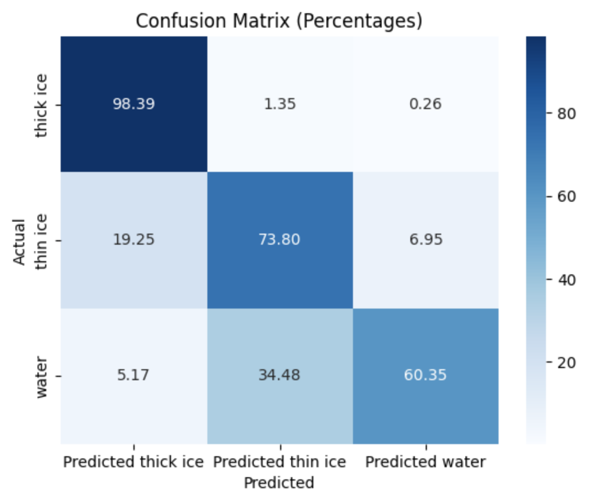 | 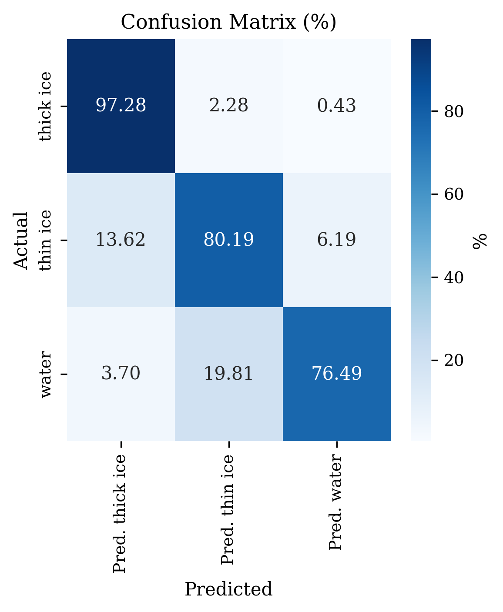 |

Same structure, same dominant diagonal. The differences are in the minority rows: the paper loses
34.5 % of open water to thin ice and 5.2 % to thick ice, where this run loses 19.8 % and 3.7 %. (The
paper's figure prints 60.35 % for the open-water diagonal while its text says 60.25 %; the text
value is used in section 1.)

### Sea ice classification, track 20191104195311_05940510_gt2r (paper Fig. 6a)

| Paper | This run |
|---|---|
| 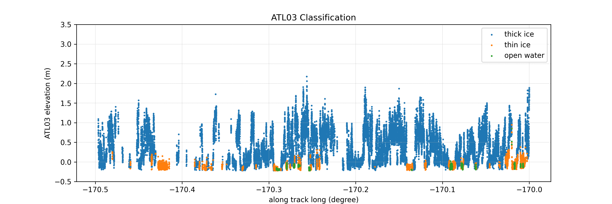 | 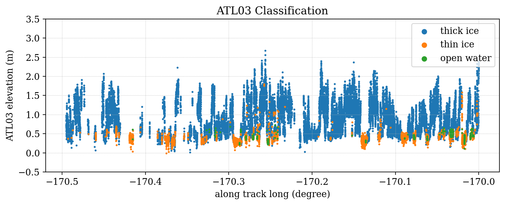 |

The same longitude window, and the same physical structure: ice floes as tall blue clusters,
leads as low orange and green bands between them, with the floe pattern matching feature for
feature across the whole window.

**One systematic difference:** the paper's elevations sit roughly 0.4 m lower than ours. That is not
a disagreement in the data. Notebook 6 plots `h_cor_mean - h_diff_avg`, where `h_diff_avg` is the
mean ATL03-minus-ATL07 height difference for that track, so the paper's panels are calibrated onto
the ATL07 datum. Without the ATL07 granules that offset cannot be computed, so our panels stay on
the raw ATL03 mean-sea-surface datum. Subtracting a constant does not change classification or
freeboard, both of which are differences of heights.

### Sea ice classification, track 20191126182014_09290510_gt2r (paper Fig. 7a)

| Paper | This run |
|---|---|
| 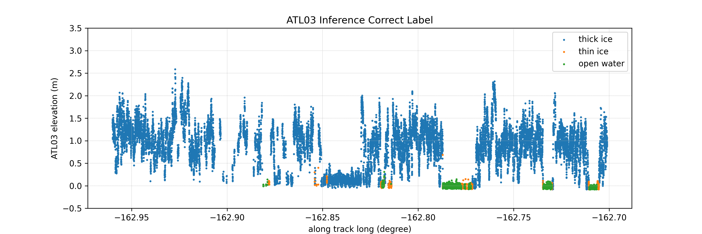 | 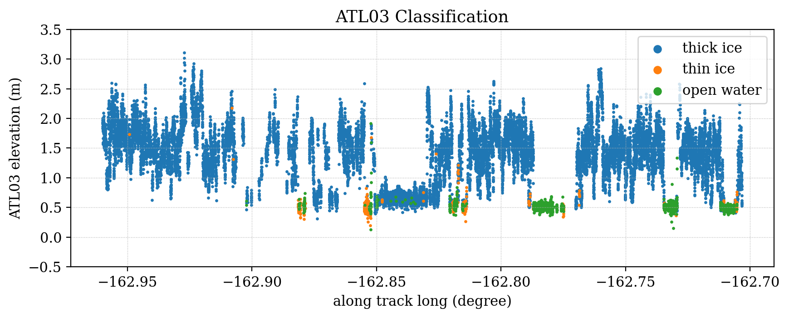 |

Same window, same floe-and-lead sequence. This run labels noticeably more of the low-elevation
returns as open water rather than thin ice, which is the 16-point per-class difference of section 1
seen directly.

### Local sea surface, four methods (paper Fig. 8a)

| Paper | This run |
|---|---|
| 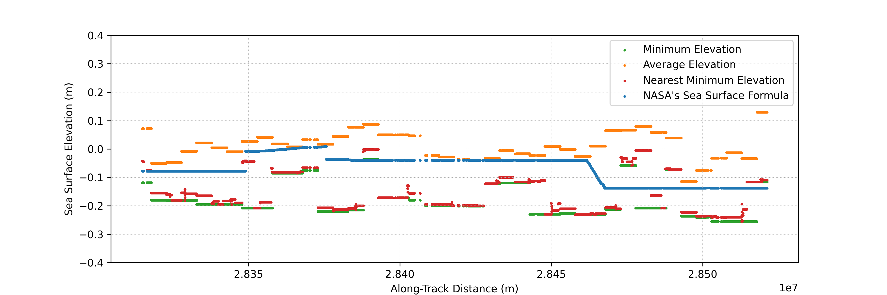 | 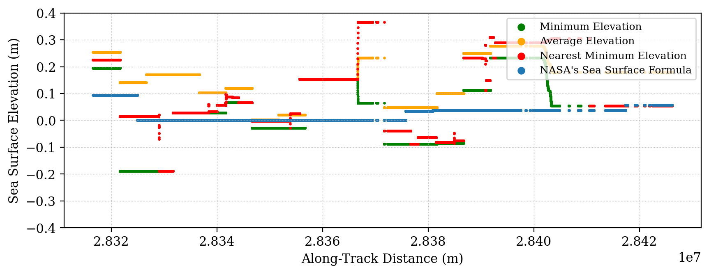 |

Both show the same ordering and the same behaviour: minimum elevation (green) lowest, average
elevation (orange) highest, nearest-minimum (red) between them, and NASA's formula (blue) as the
flat, stable line that the paper selects for exactly that reason. Our panel is centred on the median
of the NASA estimate, since the paper's absolute datum again depends on the ATL07 offset.

### Freeboard along track (paper Fig. 10a)

| Paper | This run |
|---|---|
| 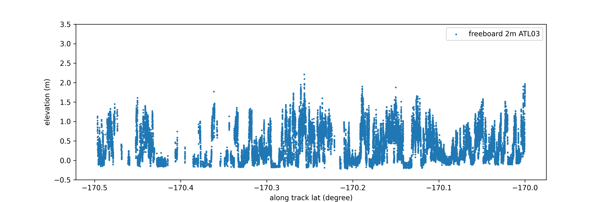 | 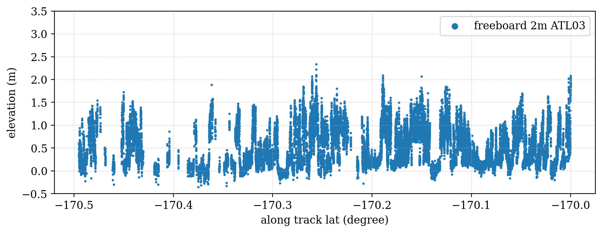 |

Same range, 0 to about 2 m, and the same along-track structure of thick floes separated by
near-zero lead segments.

### Point density (paper Fig. 10d)

| Paper | This run |
|---|---|
| 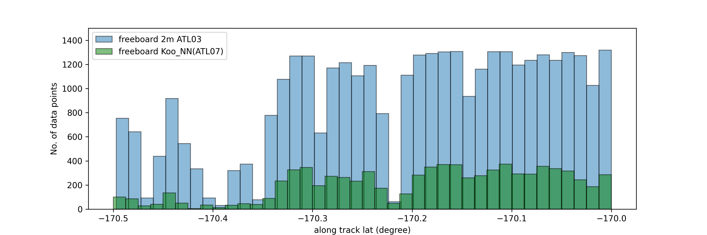 | 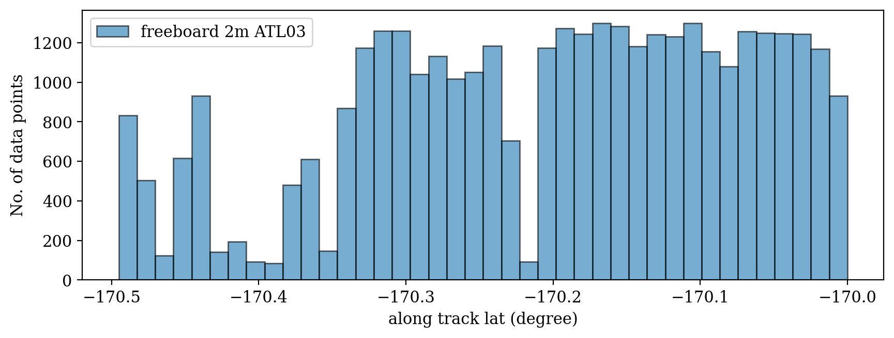 |

The paper's version overlays ATL07 in green to make its density argument. Ours has the ATL03 bars
only, at comparable counts per bin, but the comparison itself needs the ATL07 granules.

### Panels with no counterpart

The paper's ATL07 panels (Figs. 6b, 7b, 10b, 10c, 11b, 11c) have nothing to compare against here
until the reference granules are supplied. For reference, this is the paper's Fig. 6b:

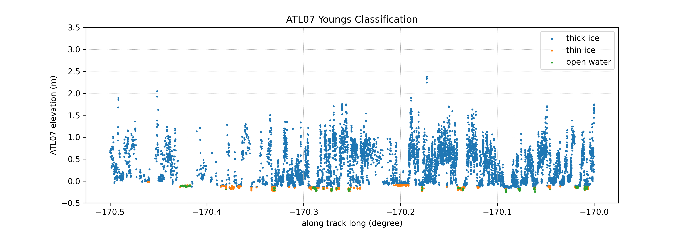

Read against our Fig. 6a above, the resolution argument is visible even without an overlay: the same
longitude window carries far fewer ATL07 points than ATL03 segments.

### Figures with no counterpart in the paper

| | |
|---|---|
| 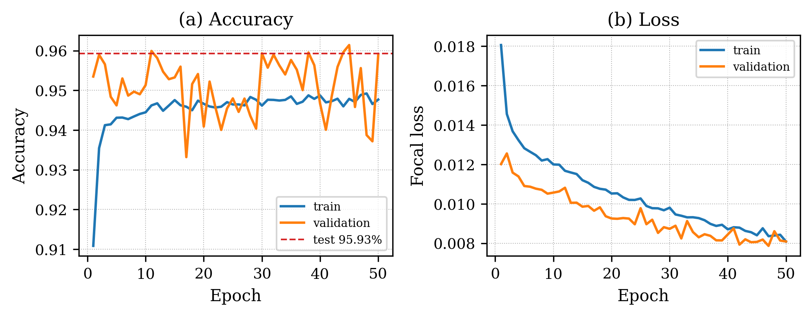 | 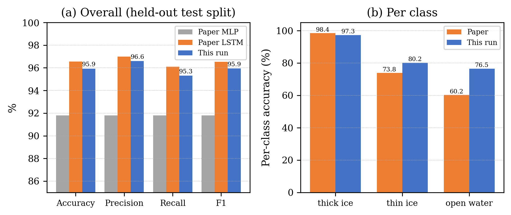 |
| Training and validation curves over 50 epochs | Section 1's numbers as a chart |
| 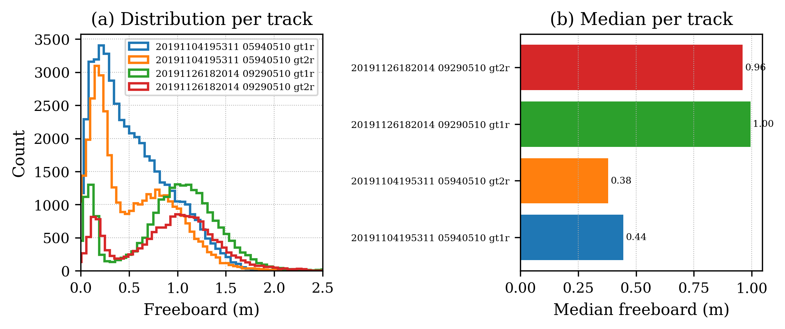 | 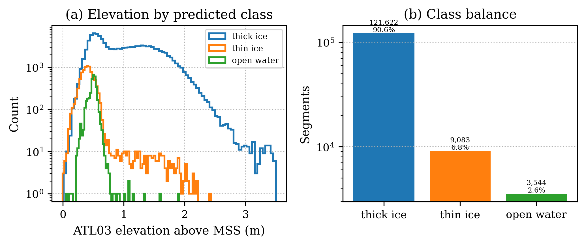 |
| Freeboard across all four processed tracks | Elevation by predicted class, and class balance |

The last one is a useful sanity check: open water and thin ice cluster tightly just above the sea
surface while thick ice extends to 3.5 m, which is what the physics requires and what a mislabelled
model would not produce.

---

## What is still missing

**ATL07 and ATL10 granules for the two paper tracks.** Every empty panel above needs them, and so do
the paper's central validation claims: that our sea surface differs from ATL07's by "little over
0.1 m", and that our freeboard is denser than ATL10's at comparable peak values.

The author's notebooks read these from a `csv_Iqrah/` directory, in Koo et al. (2023) format. The two
files needed are:

```
csv_Iqrah/ATL07-02_20191104185303_05940501_005_01.csv
csv_Iqrah/ATL07-02_20191126172006_09290501_005_01.csv
```

Two ways to supply them:

1. **Ask the author for those CSVs.** They carry Koo's classifier labels (0 water, 1 thin ice,
   2 thick ice) plus `h_ref`, `freeboard`, `h_ref_10` and `freeboard_10`, which is exactly what the
   comparison figures expect. Then:
   ```bash
   python workflow_generator.py --input-dir data/IS2_Corrected_data \
       --atl07-dir ./csv_Iqrah --atl10-dir ./csv_Iqrah -o workflow.yml
   ```
2. **Download the NASA granules** (needs an Earthdata login, which is not configured on the submit
   host):
   ```bash
   export EARTHDATA_TOKEN="..."
   python bin/download_data.py --products atl07,atl10 --rgt 0594,0929 \
       --start-date 2019-11-04 --end-date 2019-11-26 --output-dir ./data/
   python workflow_generator.py --input-dir data/IS2_Corrected_data \
       --raw-atl07-dir ./data/atl07 --raw-atl10-dir ./data/atl10 -o workflow.yml
   ```
   NASA's `label` is `height_segment_type`, not a classifier output; `validate_freeboard.py` remaps
   it to water/ice, but thin ice cannot be recovered from those codes, so the comparison will be
   coarser than the author's.

**A Multi-Layer Perceptron arm**, if Table III is to be reproduced rather than quoted. It would be
a small addition — the same prepared feature vectors, flattened to 40 inputs, through a couple of
dense layers — but it is a second model to train, tune and keep correct, so it is only worth it if
the MLP-versus-LSTM comparison itself needs to be reproduced.

**Sentinel-2 imagery**, for the paper's Fig. 2 (auto-labelling overlay). The workflow starts from
already-labelled tracks, so it has no S2 scenes.
